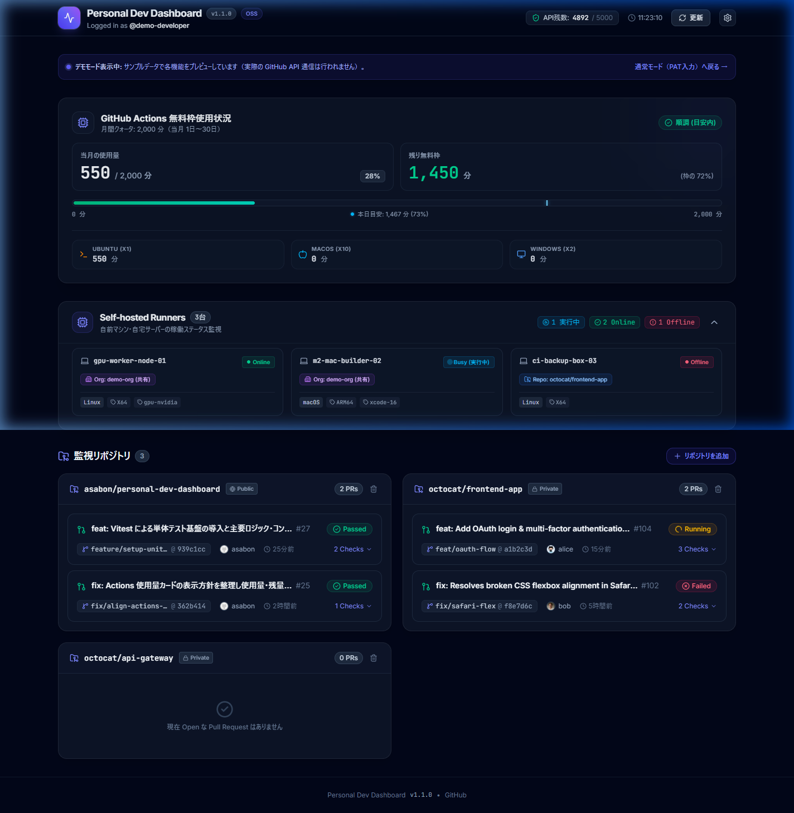

# Personal Dev Dashboard 🚀

> 個人開発者のための **GitHub Actions 使用状況 & 複数リポジトリ PR × CI 統合ダッシュボード**

[](https://github.com/asabon/personal-dev-dashboard/actions/workflows/ci.yml)
[](https://github.com/asabon/personal-dev-dashboard/releases)
[](LICENSE)

---

## 💡 概要 (Overview)

個人開発で複数のリポジトリを並行して動かしていると、以下のような不便が生じがちです：

- **「今月 Actions をどれくらい稼働・消費させたか」** を確認するために設定の課金画面まで潜る必要がある
- 各リポジトリの **「どの PR の CI が動いていて、どれが落ちたか」** を 1 画面でパッと一覧できない
- 自前で動かしている **セルフホステッドランナー（Self-Hosted Runner）** が今動いているのかオフラインなのか分からない

**Personal Dev Dashboard** は、これらの情報をブラウザ 1 画面でリアルタイムに俯瞰できる、**完全クライアント完結型 (Zero-Backend SPA)** のダッシュボードです。

<p align="center">
  
</p>

---

## ✨ 主な特徴 (Features)

- **⚡ 完全クライアント完結 (Zero-Backend / BYOK)**:
  - 外部バックエンドサーバーやプロキシ API は一切不要。静的配信（GitHub Pages）だけで安全に動作します。
- **🚨 状況サマリーバー (Dashboard Highlights)**:
  - 画面最上部に異常（CI 失敗、Actions 枠の警戒、Runner 停止）や実行中ジョブの要約を集約表示。
  - クリックまたはタップで該当カードへ即座にスムーズスクロール。
- **📱 スマホ向け簡易表示モード (Compact View) & レスポンシブヘッダー**:
  - ヘッダーのトグルボタンで「詳細モード」と「簡易表示モード（アコーディオン折りたたみ）」をワンクリック切り替え。
  - スマートフォンや狭小画面（360px〜）でもヘッダーが美しく折り返され、文字切れのない快適なモバイル監視を実現。
- **📊 GitHub Actions 使用状況の常時並列表示 & 残量ファースト**:
  - 個人（Personal）および全監視 Organization の Actions 使用状況を、タブ切り替え不要で常時並列表示。
  - 各アカウントの残り無料枠をタイトルのすぐ横（スマホでは見やすい縦並びリスト）に常時掲示。
  - 月間クォータ（2,000分等）を基準に、当月の使用量（換算目安）と残り無料枠を直感的に可視化。
  - OS ごとの消費倍率（**Ubuntu: 1倍、macOS: 10倍、Windows: 2倍**）を自動適用して無料枠換算消費量を算出。
  - 当日の暦日進捗に応じた「本日目安」インジケーターと、消費ペース判定（`順調` / `やや速い` / `ハイペース` / `残り僅か`）を自動表示。
  - OS 別（Ubuntu / macOS / Windows）の実稼働時間内訳も確認可能。

> [!IMPORTANT]
> **GitHub Actions 使用量の集計仕様（制約事項）について**  
> 本アプリケーションが表示する Actions 使用量は、GitHub 公式 API（`billing/usage/summary`）から取得した **「パブリックおよびプライベートリポジトリを合算した総稼働時間（Gross Metered Usage）」** に基づいて算出されています。  
> GitHub Web サイトの Billing 画面に表示される無料枠ゲージ（プライベートリポジトリのみを対象とした Included minutes）とは異なり、**パブリックリポジトリでの無料実行時間も合算されてカウントされます**（GitHub 公式 API 仕様上の制約です）。  
> そのため、本ダッシュボードの残り枠やペース判定は、**「月間 2,000 分のクォータを基準とした全体の稼働ペース管理の目安」** としてご活用ください。

- **🔍 複数リポジトリの PR & CI 統合ビュー**:
  - 監視対象リポジトリの Open な Pull Request と CI チェック結果（Check Runs）を 1 画面に集約。
  - PR を開く前から `All passed (3/3)`、`1 failed (2/3 passed)`、`3 Checks (2 passed, 1 running)` 等のチェック詳細（分子/分母）が一目で把握可能。
  - リポジトリ階層でも `2/2 PRs passed` や `1/2 PRs failed` と PR 単位の状況を集約表示。
  - 失敗したチェックの詳細ログへワンクリックでジャンプ可能。
- **🖥️ セルフホステッドランナー監視 (任意)**:
  - リポジトリまたは Organization の Self-Hosted Runners の稼働状況（online / busy / offline）を一覧表示。
- **📦 統一されたカード階層 & 閲覧特化 UI**:
  - 「Actions 使用状況」「Self-hosted Runners」「監視リポジトリ」の 3 大主要機能を統一された親カードデザインで整理。
  - メイン画面は「閲覧・監視（Glanceable）」に特化し、リポジトリや Runner の登録・削除・設定変更は設定画面（⚙️）に一元化して誤操作を防止。
- **🎮 トークン不要のデモモード (?demo=true)**:
  - URL に `?demo=true` を付けるだけで、PAT なしで誰でもすぐに動くダッシュボードを体験可能。
- **🎨 開発者向けモダンダークテーマ**:
  - サブモニターやデスクトップの片隅に常時表示しやすい、洗練されたダークテーマ UI。

---

## 🔒 セキュリティ & プライバシー (Security)

本アプリケーションは、ユーザーの機密情報（Personal Access Token）を最高レベルで保護するよう設計されています：

1. **トークンはブラウザ内にのみ保存**:
   - 入力された PAT はお使いのブラウザの `localStorage` にのみ保存され、外部のバックエンドサーバーには一切送信されません。
2. **ブラウザネイティブの強制遮断 (CSP: Content Security Policy)**:
   - `index.html` に厳格な CSP を設定しており、ブラウザ自身が **`https://api.github.com/` 以外の未知のドメインへの通信を物理的に遮断** します。
3. **自動テストによる安全性保証**:
   - すべての通信先が公式 GitHub API のみであること、URL パスや Cookie 等へトークンが漏洩しないことを **CI 自動テスト（Vitest）で常時検証** しています。

---

## 🌐 今すぐ使う (Live Demo) & 🚀 はじめかた (Quick Start)

トークンを入力せずに実際の動く画面を試したい方は、デモモードですぐに体験いただけます：  
👉 **[🌟 デモモードを開く (https://asabon.github.io/personal-dev-dashboard/?demo=true)](https://asabon.github.io/personal-dev-dashboard/?demo=true)**

ご自身の GitHub データで本格的に利用する場合は、インストール不要で 3 ステップですぐに利用できます：  
👉 **[🚀 通常モードを開く (https://asabon.github.io/personal-dev-dashboard/)](https://asabon.github.io/personal-dev-dashboard/)**

インストール不要で、ブラウザから 3 ステップですぐに利用できます：

### Step 1: GitHub Personal Access Token (PAT) を取得
- 最も手軽なのは **[Classic PAT（スコープ自動選択リンク）](https://github.com/settings/tokens/new?scopes=repo,user&description=Personal%20Dev%20Dashboard)** からの発行です。
  - 必要な権限（`repo`, `user`）が自動で選択されています。画面下部の「Generate token」をクリックしてトークン文字列（`ghp_...`）をコピーしてください。
  - ※セルフホステッドランナーを監視する場合は、追加で `manage_runners:org`（またはリポジトリの管理者権限）が必要です。
  - 詳細ガイド: [**🔑 GitHub PAT 作成・設定ガイド (docs/user/setup-pat.md)**](docs/user/setup-pat.md)

### Step 2: ダッシュボードを開いてトークンを入力
- [**Personal Dev Dashboard**](https://asabon.github.io/personal-dev-dashboard/) をブラウザで開きます。
- 初回モーダルにコピーした PAT を貼り付け、「利用を開始する」をクリックします。

### Step 3: 監視したいリポジトリを登録
- 右上の設定アイコン（⚙️）を開き、監視したいリポジトリ（例: `owner/repo`）や Organization、Self-hosted Runner を登録します。

---

## 🛠 ローカル開発 & テスト (Development)

```bash
# リポジトリのクローン & 依存関係のインストール
git clone https://github.com/asabon/personal-dev-dashboard.git
cd personal-dev-dashboard
npm install

# ローカル開発サーバーの起動 (http://localhost:5173/)
npm run dev

# 単体テスト & セキュリティテストの実行 (Vitest)
npm test

# 型チェック & プロダクションビルド
npm run typecheck
npm run build
```

---

## 📚 ドキュメント (Documentation)

### 👤 利用者向けガイド
- 🔑 [**GitHub PAT 作成・設定ガイド (docs/user/setup-pat.md)**](docs/user/setup-pat.md)  
  Classic / Fine-grained PAT の詳しい発行手順、必要な権限、トラブルシューティング

### 🛠 開発・設計ドキュメント
設計の詳細は [`docs/dev/`](docs/dev/) 配下に整理されています：

- 🏛️ [**システムアーキテクチャ (docs/dev/architecture.md)**](docs/dev/architecture.md): クライアント完結型設計、セキュリティとトークン管理、技術選定
- 📡 [**GitHub API 設計 (docs/dev/api-design.md)**](docs/dev/api-design.md): REST と GraphQL による効率的なデータ取得とレート制限対策
- 🧩 [**データモデル (docs/dev/data-model.md)**](docs/dev/data-model.md): ローカル設定・キャッシュ構造、TypeScript 型定義
- 🖥️ [**UI / UX 設計 (docs/dev/ui-design.md)**](docs/dev/ui-design.md): 画面レイアウト、コンポーネント構成、オンボーディング導線
- 🧪 [**テスト方針 & テスト観点仕様書 (docs/dev/testing.md)**](docs/dev/testing.md): Vitest テスト設計、セキュリティ・ロジック・UI の検証項目
- 🚀 [**開発・リリース運用ガイド (docs/dev/release-flow.md)**](docs/dev/release-flow.md): ブランチ戦略、リリース自動公開、CI/CD 設計
- 🗺️ [**開発ロードマップ & 実装実績 (docs/dev/roadmap.md)**](docs/dev/roadmap.md): 開発実績、マイルストーン、今後の拡張アイデア

---

## 🛠 技術スタック (Tech Stack)

- **Frontend**: React 19 / TypeScript (Strict) / Vite
- **Styling**: Tailwind CSS v4 / Lucide Icons
- **Testing**: Vitest / React Testing Library / jsdom
- **Deployment**: GitHub Pages (via GitHub Actions)
- **License**: [MIT](LICENSE)
