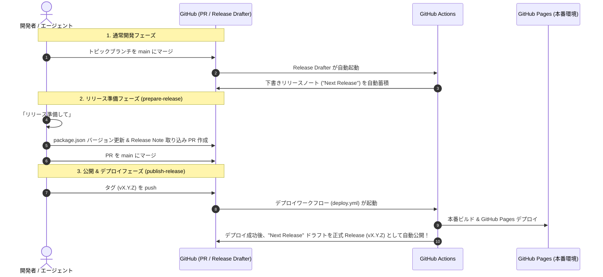

# 開発・ブランチ・リリース運用ガイド (Development & Release Flow)

## 1. 概要

本プロジェクトは **GitHub Flow** をベースにしつつ、リリース・デプロイには **Release Drafter** と **GitHub Releases 自動公開** を組み合わせた、Web アプリケーションに最適化された安全な自動化パイプラインを採用しています。

---

## 2. ブランチ戦略 (GitHub Flow)

```
[ feature/xxx ] ──(コミット)──> [ PR 作成 ] ──(CI 通過)──> [ main へマージ ]
```

- **`main` ブランチ**:
  - 常に動作可能な最新の開発コードを保持します。
  - 直接 push / commit は禁止されています（GitHub のブランチ保護 + ローカル Git Hook による二重防止）。
  - 必ずトピックブランチから PR 経由でマージします。
- **トピックブランチ (`feature/*`, `fix/*`, `chore/*`)**:
  - 新機能や不具合修正ごとに作成します。
  - 命名例:
    - `feature/actions-usage-card`
    - `fix/token-validation-error`
    - `chore/update-dependencies`

> [!TIP]
> **ローカルでの誤コミット防止設定 (Git Hook)**:
> リポジトリ内の `.githooks/` を有効化するため、初回セットアップ時に以下を実行します。
> ```bash
> git config core.hooksPath .githooks
> ```
> これにより、`main` ブランチでの直接 `git commit` および `git push` が自動でブロックされます。

---

## 3. リリース運用フロー（3 つのステップ）

Web アプリケーション（GitHub Pages）の特性に合わせ、ストア審査や中間テスト（Pre-Release）を挟まず、**「デプロイ成功時に Release を正式公開する」** シンプルで事故のないフローを採用しています。



### ステップ 1: 通常開発時（Release Drafter が下書き蓄積）
- トピックブランチが `main` にマージされるたび、`.github/workflows/release-drafter.yml` が自動起動します。
- PR のタイトルやラベル（`feature`, `fix`, `chore`, `refactor`, `docs` 等）に基づいて、GitHub Releases 上の「Next Release」下書きに差分が自動分類・蓄積されます。

### ステップ 2: リリース準備 (`prepare-release` スキル)
- リリースを行いたいタイミングで、エージェントへ「リリース準備して」と依頼。
- "Next Release" に蓄積された変更規模から次期バージョンを決定し、`package.json` のバージョン更新 PR（例: `chore/release-v0.2.0`）を作成します。

### ステップ 3: リリース公開 & 自動デプロイ (`publish-release` スキル)
- リリース PR を `main` にマージ後、エージェントへ「公開して」と連絡。
- タグ（例: `v0.2.0`）が push され、`.github/workflows/deploy.yml` が起動します。
- プロダクションビルドおよび GitHub Pages へのデプロイが実行され、**デプロイが成功したタイミングで、GitHub 上の "Next Release" 下書きが正式な Release（Latest）として自動公開** されます。

---

## 4. GitHub Actions ワークフロー構成

| ファイル | トリガー | 役割 |
| :--- | :--- | :--- |
| **`.github/workflows/ci.yml`** | `pull_request`, `push` (main) | TypeScript 型検査 (`typecheck`) & ビルドテスト (`build`) |
| **`.github/workflows/release-drafter.yml`** | `push` (main), `pull_request_target` | リリースノート草案（"Next Release"）の自動生成・追記 |
| **`.github/workflows/deploy.yml`** | `push` (tags: `v*.*.*`), 手動 | GitHub Pages デプロイ & 成功時の Release 自動公開 |
