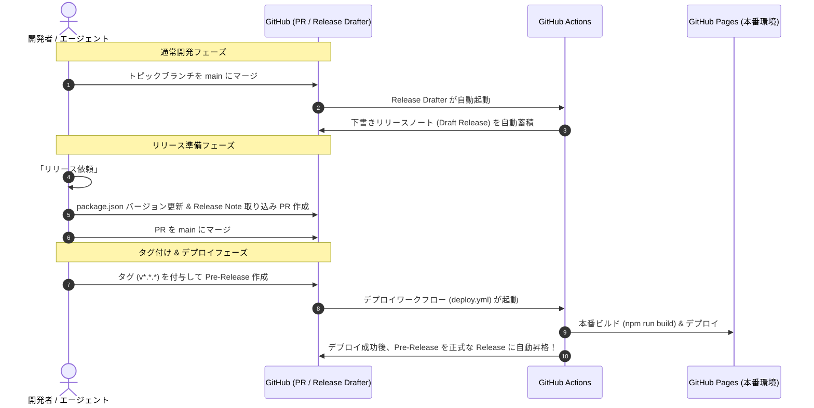

# 開発・ブランチ・リリース運用ガイド (Development & Release Flow)

## 1. 概要

本プロジェクトは **GitHub Flow** をベースにしつつ、リリース・デプロイには **Release Drafter** と **GitHub Releases (Pre-Release 昇格型)** を組み合わせた安全で自動化された運用を採用しています。

---

## 2. ブランチ戦略 (GitHub Flow)

```
[ feature/xxx ] ──(コミット)──> [ PR 作成 ] ──(CI 通過)──> [ main へマージ ]
```

- **`main` ブランチ**:
  - 常に動作可能な最新の開発コードを保持します。
  - 直接 push / commit は禁止されています（GitHub のブランチ保護 + ローカル Git Hook による二重防止）。
  - 必ずトピックブランチから PR 経由でマージします。
- **トピックブランチ (`feature/*`, `fix/*`, `chore/*`)**:
  - 新機能や不具合修正ごとに作成します。
  - 命名例:
    - `feature/actions-usage-card`
    - `fix/token-validation-error`
    - `chore/update-dependencies`

> [!TIP]
> **ローカルでの誤コミット防止設定 (Git Hook)**:
> リポジトリ内の `.githooks/` を有効化するため、初回セットアップ時に以下を実行します。
> ```bash
> git config core.hooksPath .githooks
> ```
> これにより、`main` ブランチでの直接 `git commit` および `git push` が自動でブロックされます。

---

## 3. リリース運用フロー（4 つのステップ）

Android アプリ等の実務 CI/CD パイプラインと同様の信頼性の高いリリースサイクルを採用しています。



### ステップ 1: 通常開発時（PR マージで Release Drafter が起動）
- トピックブランチが `main` にマージされるたび、`.github/workflows/release-drafter.yml` が自動起動します。
- PR のタイトルやラベル（`feature`, `fix`, `chore` 等）に基づいて、GitHub Releases 上の「ドラフト（下書き）リリース」に差分が自動分類・蓄積されます。

### ステップ 2: リリース依頼 & PR 作成
- リリースを行いたいタイミングで、エージェントへリリースを依頼（または手動実行）。
- 次期バージョンの `package.json` の更新、およびドラフトのリリースノートを取り込むための PR（例: `release/v0.1.0`）を作成します。

### ステップ 3: PR マージ & Pre-Release 作成
- リリース PR を `main` にマージします。
- マージ後、タグ（例: `v0.1.0`）を作成し、GitHub Releases で **Pre-Release** として公開します。

### ステップ 4: 自動デプロイ & 正式 Release への昇格
- タグ/Pre-Release の作成を検知して `.github/workflows/deploy.yml` が起動します。
- プロダクションビルド（`npm run build`）を実行し、GitHub Pages へ静的成果物を自動デプロイします。
- デプロイが正常に完了すると、GitHub Actions が自動で **Pre-Release を正式な Release（Latest）へと自動昇格** させます。

---

## 4. GitHub Actions ワークフロー構成

| ファイル | トリガー | 役割 |
| :--- | :--- | :--- |
| **`.github/workflows/ci.yml`** | `pull_request`, `push` (main) | TypeScript 型検査 (`typecheck`) & ビルドテスト (`build`) |
| **`.github/workflows/release-drafter.yml`** | `push` (main), `pull_request_target` | リリースノート草案の自動生成・追記 |
| **`.github/workflows/deploy.yml`** | `release` (prereleased, published), `push` (tags), 手動 | GitHub Pages デプロイ & Pre-Release から Release への自動昇格 |
